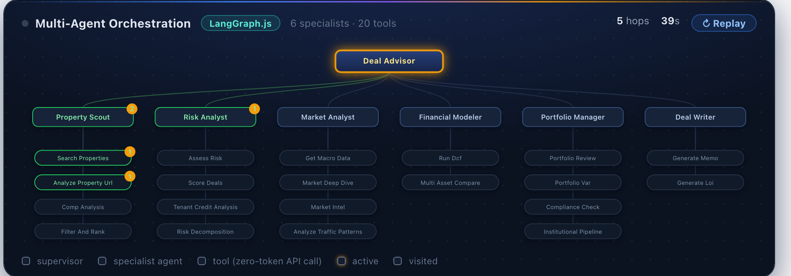
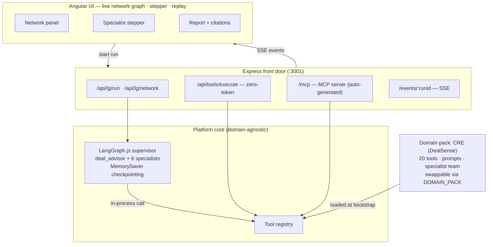

<div align="center">

# DealSense — Multi-Agent AI for CRE Private Equity

**A supervisor-orchestrated agent team that sources, scores, underwrites, and documents commercial real estate deals — built on a generic, pack-based multi-agent platform.**

[**Live Demo**](https://reagent.selvaonline.com) · [**Documentation**](https://reagent.selvaonline.com/docs/) · [**MCP Server**](https://reagent.selvaonline.com/mcp)




*A real run, live in the UI: the supervisor delegates to specialists, every tool call animates, and a hop counter and replay button make the orchestration tangible.*

</div>

---

## What it does

Ask in plain English:

> *"Find NNN Walgreens deals in Florida, assess the risk and tenant credit of the best one, run a 10-year DCF on it, and draft an investment committee memo."*

A **Deal Advisor** supervisor decomposes the request and delegates to a team of six specialists — Property Scout, Risk Analyst, Market Analyst, Financial Modeler, Portfolio Manager, Deal Writer — who execute **20 deterministic tools** (marketplace search, PE scoring, FRED/BLS macro risk, tenant credit, DCF, VaR, IC memos, LOIs…) and synthesize a sectioned, citation-backed report.

## Why it's interesting (beyond the demo)

| | |
|---|---|
| **Platform / domain-pack architecture** | The orchestration core is domain-agnostic. The entire CRE vertical — tools, prompts, specialist team — ships as a **domain pack** (`orchestrator/src/packs/cre/`) loaded at bootstrap via `DOMAIN_PACK=cre`. A new vertical is a new pack, zero core changes. |
| **Zero-token tool calls** | Tools execute as plain API calls (`POST /api/tools/execute`), not LLM round-trips. PE scoring, DCF math, and tenant credit are deterministic, golden-testable, and free. |
| **Judge-grade evals** | A behavioral eval suite (`orchestrator/evals/`) asserts **routing, faithfulness, completeness, honesty, and resilience** against the live SSE stream — and it caught a real defect: a flash-tier supervisor silently dropping 2 of 4 requested tasks. The fix (model tiering) was architectural, measured by the same eval. |
| **Built-in MCP server** | All 20 tools are auto-exposed over Model Context Protocol (Streamable HTTP) — connect Claude Desktop, Cursor, or Windsurf to the [hosted endpoint](https://reagent.selvaonline.com/mcp) with three lines of config. Wrappers are generated from the tool registry, never hand-written. |
| **Conversation memory** | LangGraph checkpointing per browser session: *"now run a DCF on that property"* resolves against prior turns. |
| **Glass-box UX** | Live agent network graph, per-specialist progress stepper with clickable tool chips, full specialist reports, and a **replay** button that re-animates any run in seconds. |
| **Production deployment** | One CDK stack: ECS Fargate (Playwright-capable backend + SSE), CloudFront + S3 (Angular SPA), Secrets Manager, ALB. |

## Architecture



The orchestrator is deliberately a commodity: any engine that emits the same SSE event vocabulary drives the same UI. The lasting value lives below it (deterministic tools, scoring models) and above it (the glass-box UX).

## Quick start

Prereqs: **Node 20+** and one LLM key (`OPENAI_API_KEY`, `GEMINI_API_KEY`, or `GROQ_API_KEY`).

```bash
git clone https://github.com/selvaonline/realestate-ai-agent.git
cd realestate-ai-agent

# Backend — tool registry + LangGraph supervisor, all in one process
cd orchestrator
npm install
cp .env.example .env        # add your LLM key
npm run dev                 # :3001

# Frontend
cd ../deal-agent-ui
npm install
npx ng serve                # http://localhost:4200
```

Verify: `curl localhost:3001/api/lg/health` → `{"ok":true}` and
`curl localhost:3001/api/tools/registry` lists 20 tools.

Optional keys for richer data: `SERPER_API_KEY` (web search), `FRED_API_KEY` / `BLS_API_KEY` (live macro data).

### Try these prompts

```text
Find NNN Walgreens deals in Florida and identify the best one
How creditworthy is Walgreens as a tenant on a 12-year NNN lease?
Run a DCF on a $4.2M NNN property with $290k NOI, 10 year hold — what's the IRR?
Give me a market deep dive on the Dallas metro for industrial
Find medical office buildings cap rate 7%+, then check portfolio fit and draft an IC memo
```

Follow-ups work — the conversation is threaded: *"now run a 10-year DCF on that property"*.

## Connect your AI assistant (MCP)

```json
{ "mcpServers": { "dealsense": { "url": "https://reagent.selvaonline.com/mcp" } } }
```

Claude Desktop, Cursor, Windsurf, or `claude mcp add dealsense --transport http https://reagent.selvaonline.com/mcp`. All 20 tools, generated from the registry.

## Evals

```bash
cd orchestrator
python3 evals/run_judge_evals.py            # full behavioral suite
python3 evals/run_judge_evals.py --only routing_dcf
```

Six dimensions: routing, faithfulness (answer numbers must match tool outputs verbatim), completeness, honesty/refusal, resilience (search retry), latency budgets. Cases are data (`evals/judge_cases.json`); checks are typed. [The defect the evals caught →](https://reagent.selvaonline.com/docs/evals/)

## Project structure

```
orchestrator/
  src/platform/        # domain-agnostic core: tool registry, DomainPack interface
  src/packs/cre/       # the CRE vertical: 20 tools, prompts, specialist team
  src/langgraph/       # supervisor + topology (reads the active pack)
  src/routes/          # /api/lg, /api/tools, /mcp (auto-generated wrappers)
  evals/               # judge-grade behavioral evals
deal-agent-ui/         # Angular 17: network graph, stepper, dashboards, DCF/sensitivity panels
infra/                 # AWS CDK: Fargate + ALB + CloudFront + S3 + Secrets Manager
docs/                  # MkDocs site (served at /docs in prod)
```

## Roadmap

- [ ] **Second domain pack** (equity research) as proof-of-genericity
- [ ] `agents.yaml` pack manifest — declare a specialist team without writing TypeScript
- [ ] UI panel registry — packs declare which result panels render which tool outputs
- [ ] Provider hooks for Placer.ai / SafeGraph / Google Places mobility data

## About

Built by **[Selvakumar Murugesan](https://www.linkedin.com/in/selvaonline/)** — solution architect exploring production-grade multi-agent systems: orchestration, evals, MCP, and platformization. **Open to opportunities** in AI engineering and agentic systems.

If this project is useful or interesting, a ⭐ helps more people find it.

## License

MIT — see [LICENSE](LICENSE).
