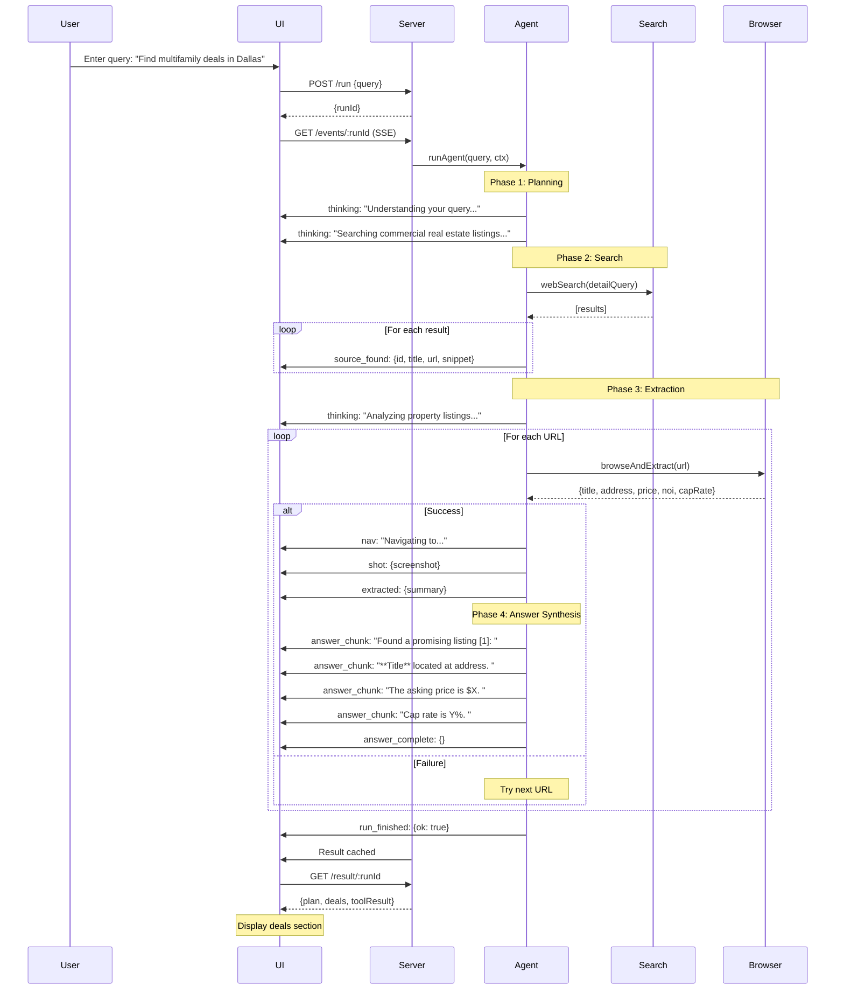
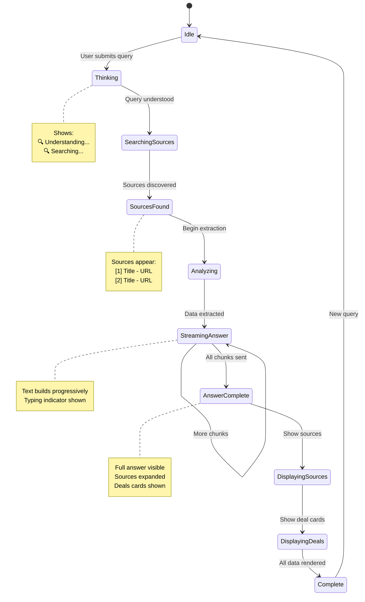

# Agent Flow Diagram

## Complete Flow Visualization



## UI State Flow



## Component Hierarchy

```
AppComponent
├── Header
│   └── "RealEstate Deal Agent"
│
├── SearchInput
│   ├── Input field
│   └── Search button
│
├── PerplexitySection (if answer || sources)
│   ├── ThinkingSteps (while !answerComplete)
│   │   └── ThinkingItem[]
│   │       ├── 🔍 icon
│   │       └── Thinking text
│   │
│   ├── AnswerSection (if answer)
│   │   ├── Answer text (streaming)
│   │   └── TypingIndicator (while !answerComplete)
│   │       └── • • • (animated)
│   │
│   └── SourcesSection (if sources && answerComplete)
│       ├── "Sources" heading
│       └── SourceItem[]
│           ├── [n] Citation number
│           └── SourceContent
│               ├── Title (link)
│               └── Snippet
│
├── TimelineDetails (collapsible)
│   └── Timeline
│       └── Card[]
│           ├── Thinking cards
│           ├── Source cards
│           ├── Navigation cards
│           ├── Screenshot cards
│           └── Extraction cards
│
└── DealsSection (if deals)
    ├── "Deals" heading
    └── DealCard[]
        ├── Title
        ├── Source link
        ├── Address
        ├── Metrics (price, NOI, cap, DSCR)
        └── Screenshot
```

## Event Timeline

```
Time    Event                     UI State
────────────────────────────────────────────────────────────
T+0     run_started               Show "Setting up..."
T+1     thinking: "Understanding" Show thinking step
T+2     thinking: "Searching"     Show thinking step
T+3     source_found [1]          Add source to list
T+4     source_found [2]          Add source to list
T+5     source_found [3]          Add source to list
T+6     thinking: "Analyzing"     Show thinking step
T+7     nav: "Navigating..."      Show in timeline
T+10    shot: {screenshot}        Show screenshot
T+11    extracted: {summary}      Show in timeline
T+12    answer_chunk: "Found..."  Start streaming answer
T+13    answer_chunk: "**Title**" Continue streaming
T+14    answer_chunk: "located"   Continue streaming
T+15    answer_chunk: "price is"  Continue streaming
T+16    answer_complete           Hide typing indicator
                                  Show sources section
T+17    run_finished              Enable new search
T+18    result received           Show deal cards
```

## Data Flow

```
┌─────────────┐
│    User     │
│   Query     │
└──────┬──────┘
       │
       ▼
┌─────────────┐      ┌──────────────┐
│   Server    │◄────►│  Agent Core  │
│  (Express)  │      │   (Logic)    │
└──────┬──────┘      └──────┬───────┘
       │                    │
       │ SSE Stream         │ Tool Calls
       │                    │
       ▼                    ▼
┌─────────────┐      ┌──────────────┐
│     UI      │      │    Tools     │
│  (Angular)  │      │ Search/Browse│
└─────────────┘      └──────────────┘
       │
       ▼
┌─────────────┐
│  User sees: │
│  - Thinking │
│  - Sources  │
│  - Answer   │
│  - Deals    │
└─────────────┘
```
