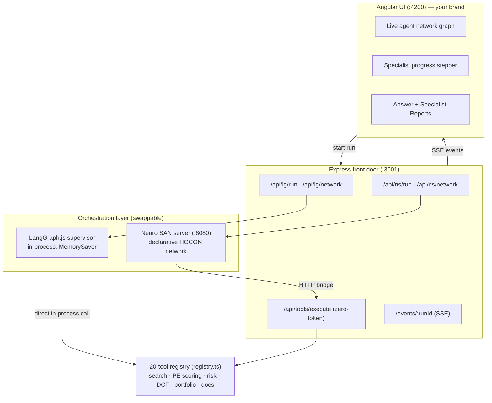

# Architecture

## The layered design

The system is deliberately hexagonal: the **orchestration engine is a
swappable layer**, and everything of lasting value sits either above it
(brand, UI, UX) or below it (tools, scoring models, data access).

## The event contract

Both orchestrators translate their internal progress into one SSE vocabulary
published on `/events/:runId`. The UI doesn't know which engine is running.

| Event | Meaning |
|---|---|
| `run_started` / `run_finished` | Run lifecycle |
| `ns_hop` | Delegation hop: `{chain: [deal_advisor, risk_analyst, assess_risk], target, targetType}` — drives the live graph |
| `thinking` | Human-readable activity line |
| `tool_executing` / `tool_complete` | Tool lifecycle (+ `durationMs` on LangGraph) |
| `agent_step` | Structured step: `delegate` / `tool_call` / `tool_result` / `finding` |
| `answer_chunk` / `answer_complete` | Final report (HTML), incl. the Specialist Reports appendix |

## Design decisions

!!! note "API over MCP for internal tool calls"
    Tools execute as plain HTTP/in-process calls — **no tokens spent on tool
    transport**. MCP remains at the edge (`/mcp`) for external
    interoperability. Choose the boring technology where it's strictly
    better; spend tokens only on reasoning.

!!! note "Generated, never hand-written, agent config"
    `neurosan/generate_network.py` builds the Neuro SAN HOCON from the live
    tool registry; LangGraph's `specialists.ts` mirrors the same groupings.
    The agent network cannot drift from the backend.

!!! note "Deterministic detail, prompt-independent"
    Every specialist's full finding is captured server-side and appended to
    the answer as expandable *Specialist Reports* — the user always gets the
    detail even if the supervisor LLM summarizes tersely.

!!! note "Model tiering"
    The supervisor needs planning discipline; specialists need speed. On
    Gemini: supervisor = `gemini-2.5-pro`, specialists = `gemini-2.5-flash`.
    This fixed a real completeness defect caught by the evals — see
    [Evals](evals.md#the-defect-the-evals-caught).

## Multi-hop context passing

The supervisor passes concrete context forward: the scout's chosen property
(title, URL, price, NOI) feeds the risk analyst, whose verdict feeds the
financial modeler, whose IRR feeds the deal writer. In LangGraph mode the
conversation itself is checkpointed (`MemorySaver` + `thread_id`), so
follow-up queries like *"now run a DCF on that property"* resolve against
prior turns.
