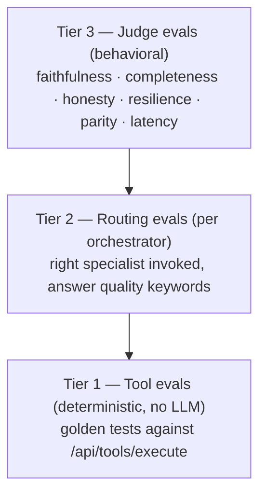

# Evals

> "If you don't have good quality evals, you're not even going to pass QA
> level." — the advice this project is built around.

## The three-tier pyramid



| Tier | Runner | LLM needed | Speed |
|---|---|---|---|
| 1 | `neurosan/evals/run_tool_evals.py` | No | seconds |
| 2 | `neurosan/evals/run_agent_evals.py` | Yes | ~1 min/case |
| 3 | `neurosan/evals/run_judge_evals.py --orch lg\|ns` | Yes | 1–7 min/case |

## Tier 3: the judge suite

Orchestrator-agnostic — drives the system through the same SSE contract the
UI uses, so it validates the full stack. Seven dimensions:

| Case | Dimension | What it asserts |
|---|---|---|
| `routing_dcf` | Routing | DCF ask → `financial_modeler` invoked |
| `faithfulness_dcf_numbers` | **Faithfulness** | IRR & equity multiple in the *answer* match the `run_dcf` *tool output* exactly; contradicting claims fail |
| `completeness_multi_intent` | **Completeness** | 4-intent ask → ≥3 required specialists ran, answer carries risk + IRR content |
| `honesty_refusal` | Honesty | Off-topic ask → **zero** specialists invoked |
| `honesty_missing_data` | Honesty | DCF with no price/NOI → asks for inputs or discloses assumptions; never fabricates |
| `resilience_search_retry` | Resilience | Impossible criteria → `search_properties` called ≥2× (relaxed retry) |
| `parity_routing_across_orchestrators` | **Parity** | Same query through ns *and* lg routes to the same specialist |

Every case carries a `budget_s` latency budget — warn at 1×, fail at 2×.

**Current status: 7/7 passing** (June 2026).

## The defect the evals caught

This is the story worth telling. `completeness_multi_intent` **failed on its
first run**: the flash-tier supervisor stopped after 2 of 4 requested tasks
(20s — no DCF, no memo), despite prompt-level checklists.

The fix was architectural, not prompt-tweaking: **model tiering** — the
supervisor moved to `gemini-2.5-pro` (planning discipline) while specialists
stayed on `gemini-2.5-flash` (fast tool-calling). Re-run: all four
specialists, five tools, complete sectioned report, 72 seconds.

!!! success "Why this matters"
    A happy-path demo would never have surfaced this. The eval did —
    then measured the fix. That loop (eval fails → defect found → architectural
    fix → eval green) is what separates a prototype from a production
    candidate in a multi-agent system.

## Writing new cases

Add to `neurosan/evals/judge_cases.json` — each case is data, the checks are
typed (`routing`, `faithfulness_dcf`, `completeness`, `refusal`, `honesty`,
`resilience`, `parity`). Run a single case while iterating:

```bash
python3 evals/run_judge_evals.py --orch lg --only my_new_case
```
