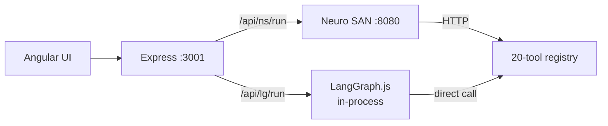

# DealSense Multi-Agent

**A supervisor-orchestrated multi-agent system for commercial real estate private equity analysis** — one team of six specialist agents over twenty deterministic tools, runnable on two interchangeable orchestration engines.

-   :material-account-supervisor:{ .lg .middle } **One supervisor, six specialists**

    ---

    A `deal_advisor` front man decomposes every request and delegates to
    Property Scout, Risk Analyst, Market Analyst, Financial Modeler,
    Portfolio Manager, and Deal Writer — each independently testable.

-   :material-swap-horizontal:{ .lg .middle } **Two orchestrators, one contract**

    ---

    Flip live between **Cognizant Neuro SAN** and **LangGraph.js** — same
    specialists, same tools, same UI. The orchestrator is a swappable layer
    behind `POST /api/{ns|lg}/run`.

-   :material-flash:{ .lg .middle } **Zero-token tool calls**

    ---

    Tools execute as plain API calls (`POST /api/tools/execute`), not LLM
    round-trips. PE scoring, DCF math, tenant credit — deterministic and free.

-   :material-check-decagram:{ .lg .middle } **Judge-grade evals**

    ---

    A three-tier eval pyramid: deterministic tool tests, routing tests, and
    behavioral evals (faithfulness, completeness, honesty, resilience,
    cross-orchestrator parity). All passing.

## Why this architecture

Multi-agent systems usually demo well and die in QA. This project is built
around the two properties that change that:

1. **Every unit is testable in isolation.** Each tool is a pure API call you
   can golden-test with no LLM. Each specialist has a fixed tool subset and
   system prompt. The supervisor's routing is asserted by evals, not vibes.
2. **The orchestrator is a commodity.** The real IP — the tool registry, PE
   scoring model, and UI — lives behind an Express front door. Neuro SAN and
   LangGraph.js plug into the same SSE event contract, proven by a parity
   eval that runs the same query through both.

## Where to next

-   **[Getting Started](getting-started.md)** — run the full stack on your laptop in ~10 minutes.
-   **[Architecture](architecture.md)** — the layered design, event contract, and design decisions.
-   **[Orchestrators](orchestrators.md)** — Neuro SAN vs LangGraph.js, and why both.
-   **[Agents & Tools](reference/agents-and-tools.md)** — every specialist and all 20 tools, generated from the live registry.
-   **[Evals](evals.md)** — the three-tier eval pyramid, and the defect the evals caught.
-   **[UI Guide](ui-guide.md)** — the live agent network graph, replay, conversation memory, and more.

